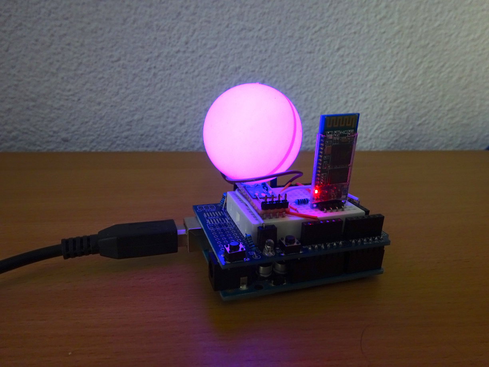
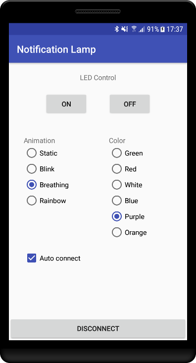

# NotificationLamp

Copyright (C) 2018 Christux

## Summary

Notification rgb lamp for Android through HC-05 module and Aduino Uno board.
A DigiSpark (attiny85) version is also available.

## Installation

The libs you should install on the ArduinoIDE are : 
<a href="https://github.com/Christux/ChristuxUtils">https://github.com/Christux/ChristuxUtils</a> 
<a href="https://github.com/Christux/ChristuxAnimation">https://github.com/Christux/ChristuxAnimation</a>

## Screenshots

  
  

## Links

<a href="https://www.arduino.cc">https://www.arduino.cc/</a> 
<a href="https://github.com/Makuna/NeoPixelBus">https://github.com/Makuna/NeoPixelBus</a>

## Keywords

ArduinoIDE, DigiSpark, NeoPixelBus, ChristuxUtils, ChristuxAnimation, Bluetooth, HC-05, Android, Notification